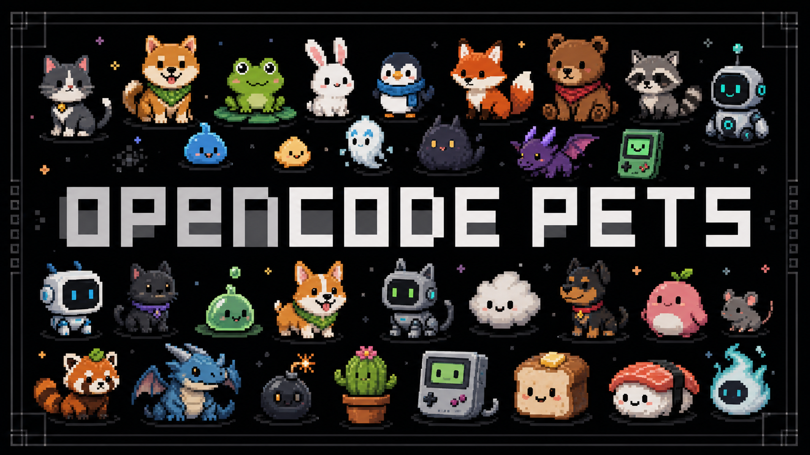

<p align="center">
  
</p>

<h1 align="center">OpenCode Pets</h1>

<p align="center">
  <strong>Make OpenCode visible with a tiny desktop pet.</strong>
</p>

<p align="center">
  An OpenCode plugin installer for automatic OpenPets status updates while your agent works.
</p>

---

## What is this?

OpenCode Pets connects OpenCode to [OpenPets](https://github.com/alvinunreal/openpets), a local desktop pet for coding agents.

OpenPets is the required desktop app/runtime. Install it from [github.com/alvinunreal/openpets](https://github.com/alvinunreal/openpets) before enabling the OpenCode plugin.

It installs an OpenCode plugin that maps agent activity to simple pet states:

- session busy → thinking
- shell commands → running/testing
- edits → editing
- permission prompts → waving
- tool success/failure → success/error

For authored pet speech, use the OpenPets MCP server. This package is for ambient automatic state transitions from OpenCode plugin events.

## Current status

OpenCode Pets is source-first right now. It expects OpenPets to be checked out next to this repo because `@openpets/client` and `@openpets/core` are local file dependencies.

```txt
~/repos/pets/
  openpets/
  opencode-pets/
```

Once the OpenPets packages are published, the simple `bunx opencode-pets install` flow will become the default path.

## Requirements

- Bun
- OpenCode
- OpenPets built locally

```bash
mkdir -p ~/repos/pets
cd ~/repos/pets
git clone https://github.com/alvinunreal/openpets.git
git clone https://github.com/alvinunreal/opencode-pets.git

cd openpets
bun install
bun run build

cd ../opencode-pets
bun install
bun test
bun run typecheck
```

Start OpenPets:

```bash
bun "$HOME/repos/pets/openpets/packages/cli/src/index.ts" start
```

## Install the OpenCode plugin from source

From the project where you use OpenCode:

```bash
bun "$HOME/repos/pets/opencode-pets/src/cli.ts" install --local-command
```

This writes:

```txt
.opencode/plugins/openpets.ts
```

If a plugin already exists at that path, it creates a timestamped backup first.

Preview the plugin instead:

```bash
bun "$HOME/repos/pets/opencode-pets/src/cli.ts" print-plugin --local-command
```

## Future package install

After publication, the intended install command is:

```bash
bunx opencode-pets install
```

That generates a plugin using the durable `bunx openpets event ...` command path.

## Test it

With OpenPets running:

```bash
bun "$HOME/repos/pets/opencode-pets/src/cli.ts" test-event thinking
bun "$HOME/repos/pets/opencode-pets/src/cli.ts" test-event testing
bun "$HOME/repos/pets/opencode-pets/src/cli.ts" test-event success
```

## How it works

```txt
OpenCode plugin event
        ↓
generated openpets.ts plugin
        ↓
OpenPets CLI
        ↓ same-user OS IPC
OpenPets desktop pet
```

The generated plugin does not send prompts, transcripts, diffs, shell output, or file contents. It sends only state, event type, source, timestamp, and the tool name when available.

OpenPets is optional: if the pet is not running, OpenCode continues normally.

## Commands

```txt
opencode-pets install [--local-command]
opencode-pets print-plugin [--local-command]
opencode-pets test-event <state>
```

## Recommended setup

For the best experience, use:

1. **OpenPets MCP** for safe authored agent speech.
2. **OpenCode Pets plugin** for automatic ambient state changes.

That gives you intentional messages plus live visual feedback.
